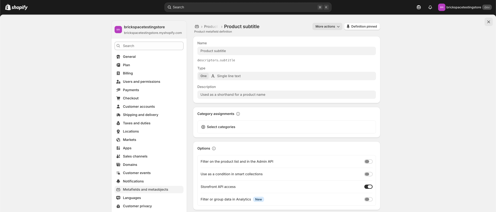

# Metafields on product cards

Product cards can show metafields in two different ways in Keystone, depending on **how** products are laid out. Merchants often expect **Theme settings → Product cards → Table details** to drive collection **grid** cards, but that setting only applies to **list and table** (row) layouts—not the grid card layout.

#### Grid cards versus list or table layouts

On collection pages (and anywhere the theme shows many products at once), Keystone renders **grid** product cards separately from **list** or **table** rows:

* **Grid view** uses the standard product card layout. Only metafields that the theme reads in code appear there. You cannot point the grid at an arbitrary comma-separated list of metafields from theme settings.
* **List or table view** uses a row-style layout meant for scanning and comparison. **Table details** in theme settings controls which extra metafields appear in that layout.

If you configure Table details but still browse the collection in **grid** view, you will not see those custom columns on the cards. Switch to the list or table style for that collection (when your section supports it), or use the grid-only options below.

For step-by-step setup of Table details, see [Custom content for tables](custom-content-for-tables.md).

#### Metafields that show on grid cards (no code)

These are fixed hooks in the theme. Create the matching metafield definitions in **Settings → Custom data → Products** and fill values per product.

| What you want                                                   | Metafield                                                                               | Theme setting                                                                                                          |
| --------------------------------------------------------------- | --------------------------------------------------------------------------------------- | ---------------------------------------------------------------------------------------------------------------------- |
| Short line under the title (tagline)                            | Namespace and key: `descriptors.subtitle` (Shopify may label this **Product subtitle**) | **Theme settings → Product cards → Enable product tagline** must be on. See [Product subtitles](product-subtitles.md). |
| Badge on the product image                                      | `custom.badge` (single line text)                                                       | Works when your card shows the badge treatment; see [Product badges](product-badges.md) (metafield method).            |
| Custom **Add to cart** (or equivalent) button label on the card | `custom.button_text`                                                                    | See [Replace "Add to cart"](replace-add-to-cart.md).                                                                   |

 (Screen shot of metafield setup)

#### Showing more information on grid cards

* **Use the tagline for extra copy.** If the **Product subtitle** (`descriptors.subtitle`) definition uses a multi-line or rich text type, you can sometimes combine a few short lines in that one field instead of many separate card fields.
* **Custom Liquid or theme edits.** To output additional metafields on grid cards, the theme’s product card templates must be extended. That is an advanced or developer change; start from [Add custom Liquid](../../advanced-customizations/adding-custom-liquid/) and treat product card snippets as the place a developer would wire new metafields.
