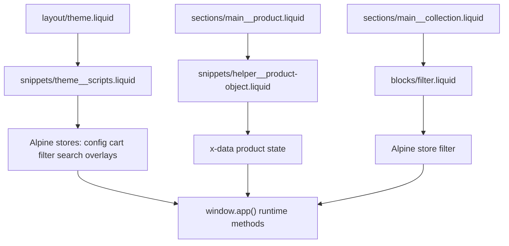

# Global, collection, and product variables

Slab data flow combines Shopify Liquid objects, section/block settings, and Alpine stores. This page maps where each variable group comes from and where it is consumed.

## Canonical files

- `/Users/thomaskimura/Documents/GitHub/slab/layout/theme.liquid`
- `/Users/thomaskimura/Documents/GitHub/slab/snippets/theme__scripts.liquid`
- `/Users/thomaskimura/Documents/GitHub/slab/snippets/helper__product-object.liquid`
- `/Users/thomaskimura/Documents/GitHub/slab/sections/main__product.liquid`
- `/Users/thomaskimura/Documents/GitHub/slab/sections/main__collection.liquid`
- `/Users/thomaskimura/Documents/GitHub/slab/blocks/filter.liquid`
- `/Users/thomaskimura/Documents/GitHub/slab/src/javascript/core/products.ts`
- `/Users/thomaskimura/Documents/GitHub/slab/src/javascript/core/cart.ts`

## Data flow overview

## Global variables

Primary source: `theme.liquid` and `theme__scripts.liquid`.

Examples:

- Theme settings from `settings.*`
- Request/customer/shop context (`request`, `customer`, `shop`, `routes`)
- Alpine global stores:
  - `config`
  - `cart`
  - `filter`
  - `pagination`
  - `search`
  - `feedback`
  - `overlays`

Use global store values when behavior is cross-page (cart UI, overlays, search, account/login state, global toggles).

## Product variables

Primary source: `helper__product-object.liquid` rendered into `x-data` in `main__product.liquid`.

Key product payload fields:

- `product` (serialized Shopify product object)
- `variants` map and selected variant IDs
- option and unavailable-option state fields (`option1`, `unavailableOption1`, etc.)
- selling plan structures and calculated pricing fields
- flags such as `isQuickEdit`, `isQuickBuy`, `enableDefaultVariant`

Runtime logic in `core/products.ts` mutates these fields as the customer selects variants, selling plans, or quick-buy/edit flows.

## Collection variables

Primary source: collection/search Liquid objects in `blocks/filter.liquid` and section settings in `main__collection.liquid`.

Common collection/search data:

- `results` assigned from `collection` or `search`
- `results.filters`
- active filter counts
- sort state
- price range min/max derived from filter values

These values initialize Alpine filter state and drive interactive filtering/sorting behavior.

## Best practices

- Keep variable ownership clear:
  - Liquid for initial truth and server-rendered context
  - Alpine stores for client-side interactive state
- When adding new fields, update both:
  - Liquid output source (snippet/section/block)
  - TypeScript/Alpine consumers
- Prefer extending existing stores and data objects over creating disconnected globals.

## Gotchas

- Product data shape can drift if new Liquid fields are added without TypeScript updates.
- Collection filter behavior depends on template context (`collection` vs `search`), so test both paths.
