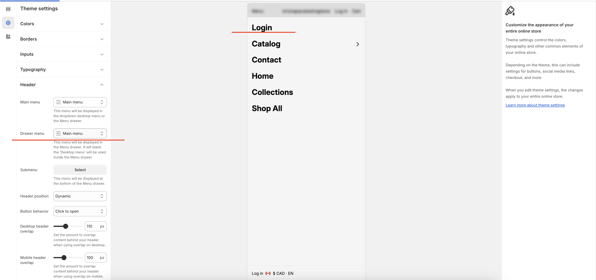

# Add login to mobile menu drawer

If the login icon is not visible in the mobile header, this is intentional. On smaller screens, adding too many header icons can cause wrapping and layout issues.

Instead, place the login link inside the mobile side drawer menu.

> Support note: "This was done intentionally as adding multiple icons/text to your header bar on mobile will cause your menu items to display oddly. This can be set up by creating a Login button via your Drawer menu and linking it to `/account`."

## Add the login link in your drawer menu

1. In Shopify, go to **Online Store** > **Themes** > **Customize**.
2. Open **Theme settings** > **Header**.
3. Under **Drawer menu**, choose the menu used for mobile navigation.
4. Click **Edit menu**.
5. Add a new menu item:
   * **Label:** `Login` (or `Log in`)
   * **Link:** `/account`
6. Save the menu, then save your theme changes.

## Check customer account settings

If the link still does not work as expected, make sure customer accounts are enabled in **Shopify admin** > **Settings** > **Customer accounts**.

<figure><figcaption></figcaption></figure>

<figure><figcaption></figcaption></figure>
